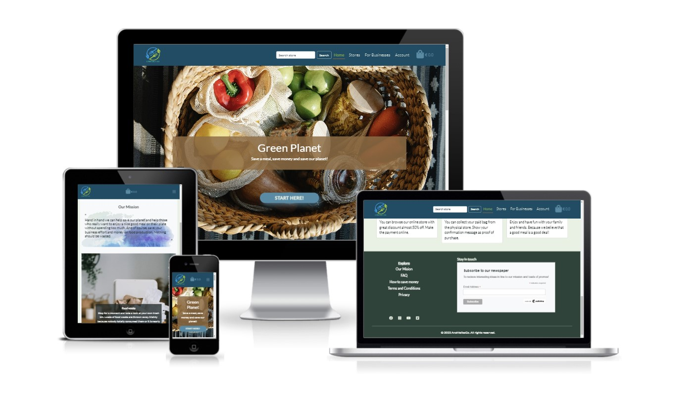

# Green Planet Save food
 

 
***
 
## Table of Contents:
* [What does it do and what does it need to fulfill?](#what-does-it-do-and-what-does-it-need-to-fulfill)
* [Functionality of Project](#functionality-of-project)
* [User Experience](#user-experience)
   * [User Stories](#user-stories)
   * [Design](#design)
       * [1. Font](#1-font)
       * [2. Color Scheme](#2-color-scheme)
       * [3. Logo](#3-logo)
       * [4. Geometry](#4-geometry)
       * [5. Wireframing](#5-wireframing)
* [Technology Used](#technology-used)
* [Database](#database)
* [Features](#features)
   * [Future Features](#future-features)
* [Testing](#testing)
   * [Defensive Design](#defensive-design)
* [Deployment](#deployment)
* [Credits](#credits)
   * [Special Thanks & Acknowledgements](#special-thanks--acknowledgements)
 
***

 
## What does it do and what does it need to fulfill?
One of the major problems in our modern world that we are facing right now is the massive waste we all produce each day and it has a terrible impact on our environment. One third of our yearly food supply is thrown away to the garbage and this is not good for our society and to our environment.

In this project, the main goal is to reduce food waste that restaurants, grocery stores, hotels and even bakery stores produce everyday and aren’t consumed totally and most of these products are thrown away in the trash. In short, we are rescuing the leftovers or surplus food.

This project is mainly an online ecommerce food shopping site. To achieve our goal, this site offers promotions to consumers who want low cost food products and goods, especially for those who have a low budget each month. It’s a good way to help those who are in need of a nice good meal.

Businesses will also have benefits in this action due to the fact that all products and goods that aren’t totally consumed or sold inside their business (restaurant, hotel, stores etc) are going to be sold through this website and are not wasted away. Businesses will still gain profit from the surplus or leftovers. Nothing should be thrown away as food production costs money, time and lots of effort.

### Favicon
 

The favicon used in this project is the same as the logo of the website to give it a sense of uniformity.
 
### Functionality of Project
This application contains a home button, the store, login button or sign up button for the consumers who are interested in purchasing food from the website, and a section for businesses. The additional information about the webpage can be found in the home page to engage the user to browse more without going to any other pages and for them to stay longer in the website. A search bar is available in the navbar so the user can search for any food or stores.

The Store section shows all the promotions available and can be filtered by the different business types like restaurants, hotels, supermarket, bakery etc who want to sell their unconsumed or unsold products. Can also be filtered by the store name, business type category, ratings and price.

The user can add items in the bag and continue to search and add more contents to it. Payment can be done through the bag itself or the notification pop up for easy access. After making the payment, a transaction number is provided to the consumer for pick up. An email confirmation is also sent to the user in case an error occurs and the website is not working well. It is explained in the FAQ section the reason why home delivery is not available.

This application also offers to businesses or companies to join the company’s mission against food waste and sell their unsold or unconsumed products. They can contact us by filling up the form to provide them with the best solution for their business.

When a user registers to the website, the user can browse to the user profile page. In this page, the user can view the contact details, the history and favourites. The user can also make changes to their contact details. If the user is an admin or superuser, this user is given access from this page to create new stores to sell food, edit and delete, create a new business type category and edit them if needed.

The footer has different links to browse for the users' additional information about the website, FAQ, terms and privacy policy. It has social media icons that are also available for the user to browse through the different social media platforms. A subscriber form is also available in the footer for the user to subscribe to newsletter easily.

 
[Back to top](#table-of-contents)
 
## User Experience:
 
#### User Stories:
_Generic (Guest/Public) User:_
* As a Generic User, I want to...
 
_Registers (Logged in) User:_
* As a Registered User, I want to...
 
_Developer:_
* As a Developer, I want to...
 
#### Design
 
##### 1. Font
lorem
 
##### 2. Color Scheme
lorem - replace as necessary
 
detail color palettes/swatches here using images.
 
The colors used throughout and what for etc....
 
##### 3. Logo
The logo was ... add detail, or remove as necessary
 

 
##### 4. Geometry
 
The application's geometrical aspects...
 
##### 5. Wireframing
 
The wireframes were created for each individual page on three different screen sizes. All the wireframes are down below.
 

Wireframes

Home page
 

 
Wish tree page
 

 
Send wishes page
 

 
Login/Register page
 

 

 
[Back to Top](#table-of-contents)
 
## Technology Used
 
#### Languages, Frameworks, Editors & Version Control:
 
* add notes here on techstack...
 
#### Tools Used:
 
* add notes here on tools used to assist in developing the project...
 
## Database
 
#### Database Schema:
 
Detail the db schema here (if applicable)....images, thoughts behind fks etc
 
## Features
 
The project boasts several key features:
* Create: ...
 
[Back to Top](#table-of-contents)
 
#### Future Features:
 
* Detail future implementations here...
 
## Testing
 
Testing was ...
 
#### Found Bugs and Fixes:
 
During manual testing...
 
[Back to Top](#table-of-contents)
 
#### Defensive Design
 
Defensive design for this application was...
 
## Deployment
 
Detail deployment here...
 
[Back to Top](#table-of-contents)
 
## Credits
 
* Detail credits
 
[Back to Top](#table-of-contents)
 
#### Special Thanks & Acknowledgements:
 
* Team 11 🤜
 
###### <i>Disclaimer: This project was created for educational use only as part of Code Institute's __________</i>
 
[Back to Top](#table-of-contents)
