# [Green Planet](https://project-5-green-planet.herokuapp.com/)
 

 
***
 
## Table of Contents:
* [What does this project do?](#what-does-it-do-and-what-does-it-need-to-fulfill)
* [Introduction](#introduction)
   * [Favicon](#favicon)
   * [Functionality](#functionality-of-project)
* [Business Model](#business-model)
* [User Experience](#user-experience)
   * [User Stories](#user-stories)
   * [Design](#design)
       * [1. Font](#1-font)
       * [2. Color Scheme](#2-color-scheme)
       * [3. Logo](#3-logo)
       * [4. Wireframing](#5-wireframing)
* [Design Thinking](#design-thinking)
* [Technology Used](#technology-used)
* [Database](#database)
* [Features](#features)
   * [Web Marketing](#web-marketing)
   * [Future Features](#future-features)
* [Testing](#testing)
* [Deployment](#deployment)
* [Credits](#credits)
   * [Special Thanks & Acknowledgements](#special-thanks--acknowledgements)
 
***

 
## Introduction

One of the major problems in our modern world that we are facing right now is the massive waste we all produce each day and it has a terrible impact on our environment. One third of our yearly food supply is thrown away to the garbage and this is not good for our society and to our environment.

In this project, the main goal is to reduce food waste that restaurants, grocery stores, hotels and even bakery stores produce everyday and aren’t consumed totally and most of these products are thrown away in the trash. In short, we are rescuing the leftovers or surplus food.

This project is mainly an online ecommerce food shopping site. To achieve our goal, this site offers promotions to consumers who want low cost food products and goods, especially for those who have a low budget each month. It’s a good way to help those who are in need of a nice good meal.

Businesses will also have benefits in this action due to the fact that all products and goods that aren’t totally consumed or sold inside their business (restaurant, hotel, stores etc) are going to be sold through this website and are not wasted away. Businesses will still gain profit from the surplus or leftovers. Nothing should be thrown away as food production costs money, time and lots of effort.

### Favicon
 

The favicon used in this project is the same as the logo of the website to give it a sense of uniformity.
 
### Functionality of Project
This application contains a home button, the store, login button or sign up button for the consumers who are interested in purchasing food from the website, and a section for businesses. The additional information about the webpage can be found in the home page to engage the user to browse more without going to any other pages and for them to stay longer in the website. A search bar is available in the navbar so the user can search for any food or stores.

The Store section shows all the promotions available and can be filtered by the different business types like restaurants, hotels, supermarket, bakery etc who want to sell their unconsumed or unsold products. Can also be filtered by the store name, business type category, ratings and price.

The user can add items in the bag and continue to search and add more contents to it. Payment can be done through the bag itself or the notification pop up for easy access. After making the payment, a transaction number is provided to the consumer for pick up. An email confirmation is also sent to the user in case an error occurs and the website is not working well. It is explained in the FAQ section the reason why home delivery is not available.

This application also offers to businesses or companies to join the company’s mission against food waste and sell their unsold or unconsumed products. They can contact us by filling up the form to provide them with the best solution for their business.

When a user registers to the website, the user can browse to the user profile page. In this page, the user can view the contact details, the history and favourites. The user can also make changes to their contact details. If the user is an admin or superuser, this user is given access from this page to create new stores to sell food, edit and delete, create a new business type category and edit them if needed.

The footer has different links to browse for the users' additional information about the website, FAQ, terms and privacy policy. It has social media icons that are also available for the user to browse through the different social media platforms. A subscriber form is also available in the footer for the user to subscribe to newsletter easily.

 
[Back to top](#table-of-contents)

## Business Model

The business model for this ecommerce project is B2C (Business to Customer). The customer purchase a food or good that aren't sold or totally consumed from a business through this app and the customer should pay in advance via online using Stripe. When payment is done successfully, an email confirmation is sent to the user for collection.

## User Experience:
 
#### User Stories:
_Generic User (guest/registered):_
* As a generic/registered, I can view the contents and payment guidelines in the homepage so that I am well informed about the website.
* As a generic/registered, I can navigate throught different pages of the website so that I can browse easily from one page to another using the navigation bar. 
* As a generic/registered, I want a home button so that I can return back to the homepage safely.
* As a generic/registered, I can click the social media links from the footer so that I can browse to different social media pages of the website.
* As a generic/registered user I can subscribe to the website's newsletter so that I recieve especial information, content that might interest me and new promotions in my email address.
* As a generic/registered user I can sign up to the website so that I can create my own profile to easily access my contact details when purchasing something from the website.
* As a generic/registered user I can browse through the frequently asked question (FAQ) page so that I can gather more information from other users questions.
* As a generic/registered user I can access the Store page easily so I can browse to all the stores that offers great promotions.
 
_Registered (Logged in) User:_
* As a Registered User, I can log in or log out to my user profile so that I can access my personal contact details.
* As a Registered User, I can get an email confirmation after registration so that I know that my registration was successful.
* As a Registered User, I can have my profile page so that I can view and edit my personal contact information.
* As a Registered User, I can view my favourites stores so that I can browse and purchase from them easily.
* As a Registered User, I can give my rating to a store so that other users can see my feedback.
* As a Registered User, I can view my purchase history so that I can view all the list of previous transactions.

_Shopper:_
* As a shopper I can browse through the different stores so that I can shop easily.
* As a shopper I can add items in the bag so that I can continue shopping or pay for the item faster.
* As a shopper I can select an specific business type category so that I can browse and search a store faster.
* As a shopper I can put filter in my query so that I can view the items according to my preference, such as low to high price, high to low rating.
* As a shopper I can view a single store so that I can see important details like the details of each bag, price, rating, images etc.
* As a shopper I can see the total amount of my purchase in the navbar so that I can keep track of my expenses.
* As a shopper I can easily view the contents of my bag when I click the Add to Bag button so that I know what I added previously and make the checkout easily without clicking the shopping bag button.
* As a shopper I can make the checkout through the bag or the notification pop up so that I can make the payment for the bag of food from the store.
* As a shopper I can make the payment online so that it is easier and faster to finish the transaction.
* As a shopper I can have a feedback in the website so that I am informed if the transaction is successful.
* As a shopper I can recieve a confirmation email of the purchase so that I can collect / pick up my bag of food.

_Administrator:_
* As an admin I want to be able to add more store with the details of the items they sell so that I can provide more stores to the users.
* As an admin I want to be able to delete a store to update the website from any old or not active businesses.
* As an admin I want to add a business type category so that I can add it to a new store.
* As an admin I want to be able to delete a business type  category without losing the stores data so that I can update a business type if needed.
* As an admin I want to provide terms and conditions to all users so that they are aware of and well informed.
* As an admin I want to provide privacy policy to the users so that we can can guarantee their data security.
 
_Developer:_
* As a Developer, I want to learn how to implement an ecommerce website.
* As a Developer, I want to be able to put a secure payment transaction to the ecommerce web application.
* As a Developer, I want to keep learning new staff about software development and improve my knowledge and skills.
* As a Developer, I want to implement a good SEO for the website to attract and engage more users.
* As a Developer, I want to keep all the process organize using the Agile software development approach.
 
#### Design
 
##### 1. Font

The font used for this project is basic and easy to recognize. I used Google fonts Lato with a 400 regular thickness.
 
##### 2. Color Scheme

The color schema was inspired by the colors of a dark night forest. Dark green and dark blue are used to give depth and intensity. The light colors is to give contrast from the dark colors. New colors were added during the development.

`#e7f0e3` is a very light green used for the webpage background

`#946C3E` is a light brown used to enfasize some links and the navbar active page css style

`#99C233` is a neon green used in the navbar
 
##### 3. Logo
The logo was created using the LogoDesigner app with templates to use for free. It  creates a png image with great resolution. The logo for this project  was designed to appear as a globe to simulate the shape of the planet as the name of the company. The circular shape is formed by forks to give more meaning to the purpose of this project.
 

 
##### 5. Wireframing
 
The wireframes were created for each individual page on three different screen sizes. All the wireframes are down below.
 

Home page

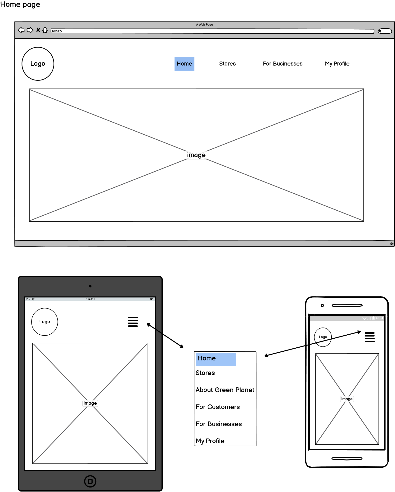

Footer

Store Page

Add Store

Store Detail

Business Type Cateogry page

Profile ppage

Bag

Checkout

 

[Back to Top](#table-of-contents)

## Design Thinking

Design Thinking was done with Agile methology in Github Projects using the kanban board.

User stories were added as issues as a guide for development.

I added tabs to visualize and easy access each iteration and moving each issue when on process, in testing mode or feature done.

Other tools or helpers were used, like: a spreadsheet, Google docs and a pen and a notebook.

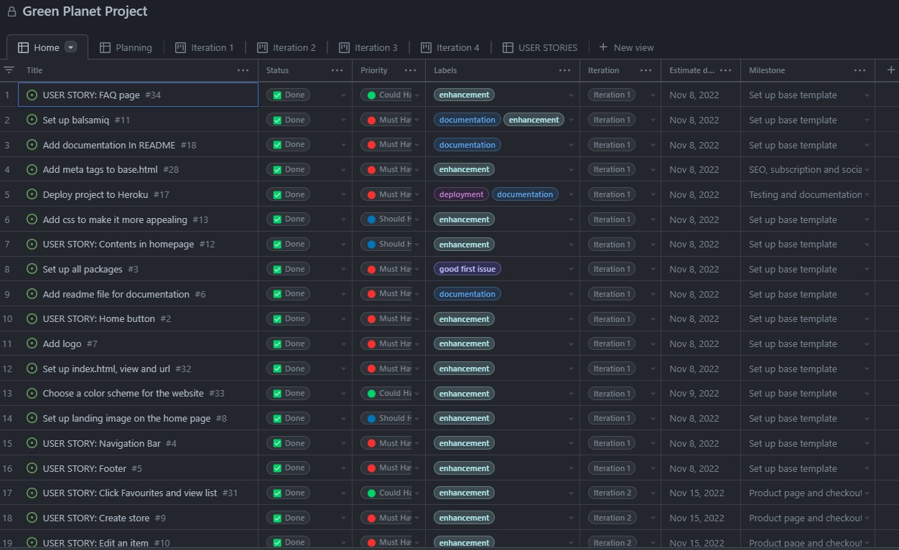
 
## Technology Used
 
#### Languages, Frameworks, Editors & Version Control:
 
* Core languages
   - HTML & CSS: For the main structure of the contents and style
   - Javascript: for a dynamic control of objects and elements in the webpage
   - Python: Object-oriented programming language

* [Django](https://www.djangoproject.com/) is a high-level Python web framework that encourages rapid development and clean, design. It's free and open source.

* [Bootstrap](https://getbootstrap.com/) a front-end framework used to style the project.

* [Gitpod](https://www.gitpod.io/) is an IDE using VS Code for remote development.

* [Git](https://git-scm.com/) is used for version control.

* [Github](https://github.com/) is used to host the project repository and linked to heroku

* [Heroku](https://www.heroku.com/) is a container-based cloud Platform to deploy and manage apps. Used to deploy this project.
 
#### Tools Used:

* Balsamiq: for wireframes creations.

* ElephantSQL: a free database. Used to migrate the database of the project and to be deploy in Heroku.

* [AWS S3](https://aws.amazon.com/) was used to store files for the webpage.

* Logo Designer: a mobile app used to create the logo and the heading of some pages of this project.

* [Iloveimg](https://www.iloveimg.com/) is an online photo editor used to edit and crop images for this project.

* Grammarly to spell check any grammar error for this project.

* Gmail is used to send and recieve email when user sends a message.

* [Mailchimp](https://mailchimp.com/?currency=EUR) to create subscription form and receive any submitted form for subscription.

* Fontawesome for the icons.

* Hover CSS for the hover effects of the icons.

* JQuery is a lightweight JavaScript library. Used to create datepicker for this project and for manipulation and event handling.

* [dbdiagram](https://dbdiagram.io) to create database schema.

* ColorZilla is an eyedropper extension that assists web developers and graphic designers with color related tasks. Used in this project to pick colors.

* Amiresponsive to mockup the webpage responsive design.

* Validator used:
   - [W3C Markup Validator](https://validator.w3.org/)
   - [W3C CSS Validator](https://jigsaw.w3.org/css-validator/)
   - [JSHint](https://jshint.com/)
   - [Pep8 CI](https://pep8ci.herokuapp.com/)

 

## Database
 
#### Database Schema:
 
The database schema was traced using dbdiagram. The database schema serves as a guide before making the view models. The database consists of the following tables: User, Store, Business Type, Checkout and Favourites.
- User is the customer online
- Store is the store details
- Business Type is the model to create the business type category
- Checkout is where all purchase go and the details of the customer
- Favourites is where all the favourites stores are.

 

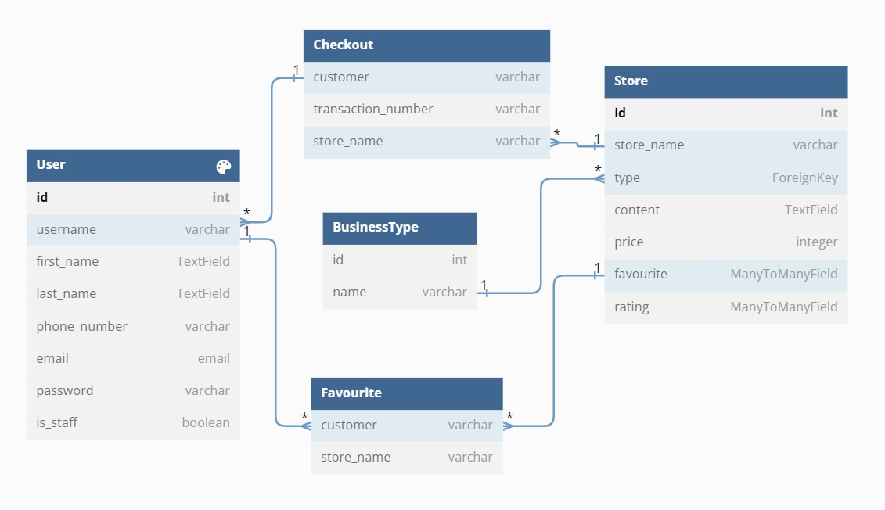

## Features
 
The project boasts several key features:

### Logo and navbar

The logo was created using the LogoDesigner app with templates to use for free. It  creates a png image with great resolution. The logo for this project  was designed to appear as a globe to simulate the shape of the planet as the name of the company. The circular shape is formed by forks to give more meaning to the purpose of this project.

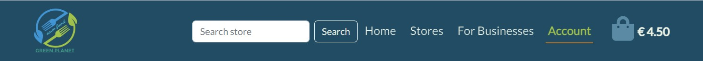

The main nav bar gives the user a different menu to browse the different pages of the application. It has a home button, stores button to show a dropdown list for the user to choose from. For businesses button is for company business to view our mission and initiative plan and to be able to join so they can sell and leftover products they don't totally consume. My account button is also provided so that the user can log in or sign up when they want to. The basket is also visible in the navbar for easy access when viewing a purchase and to make the payment. It also has a search button for the user to search any item.
When a page is currently viewed by the user, the navbar button is highlighted so that it gives a feedback to the user what page they are at.
In the responsive design, the navbar is hidden and can only be shown when clicked the square button.The basket is shown in between the logo and the square button in small devices for easy access.

#### Mobile navbar

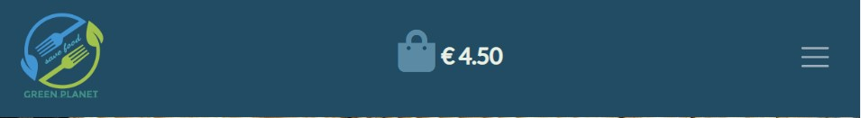

### Homepage

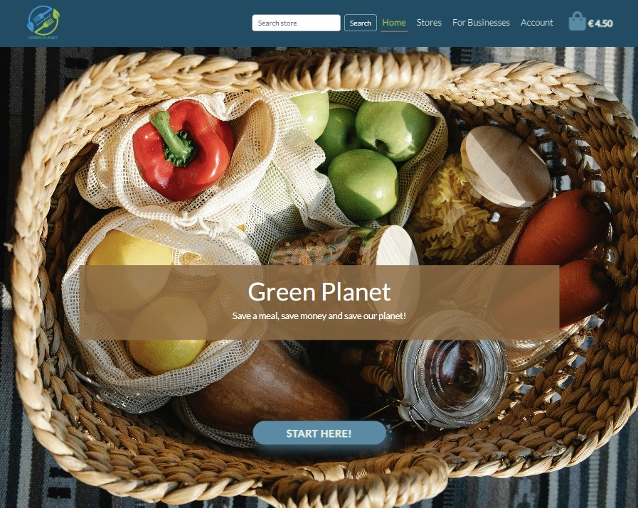

#### Our mission

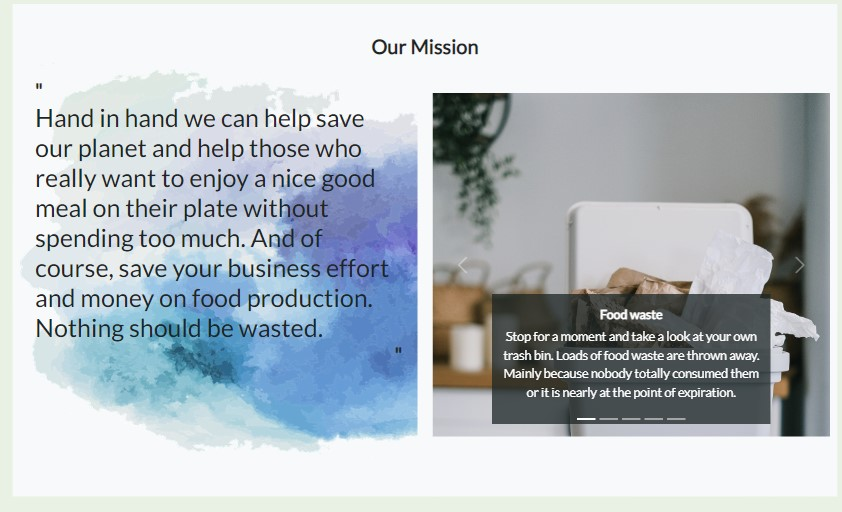

#### How to save money guide

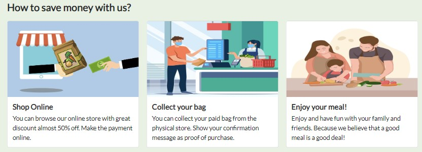

### Footer

The footer has different options to choose from. It has different options such as about, Our mission, how to save money, Terms and conditions, and policy.
It also has a section in the footer where any users can subscribe to the newsletter of the application.
At the bottom of the footer it has the copyright with my name as the developer, and a few buttons that lead the user to the social media account of the company. It opens in a different tab to prevent the user from being taken away from the webpage.

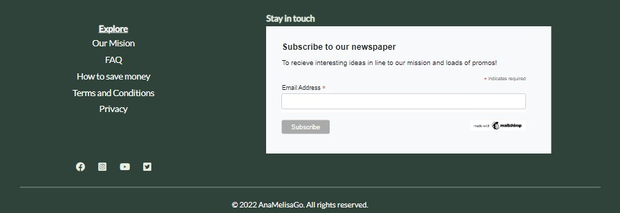

[Back to Top](#table-of-contents)

### Store Page

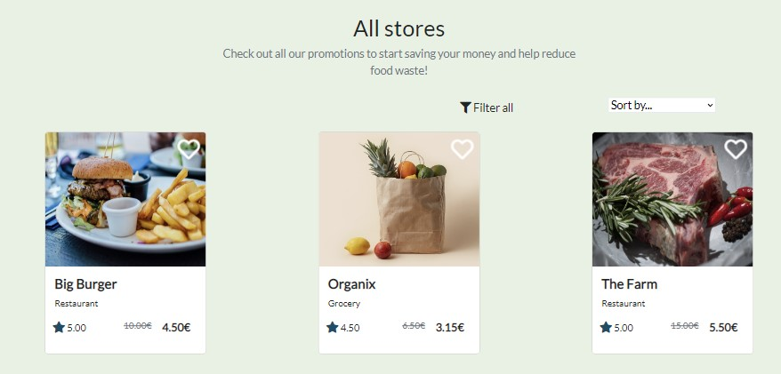

### For Businesses

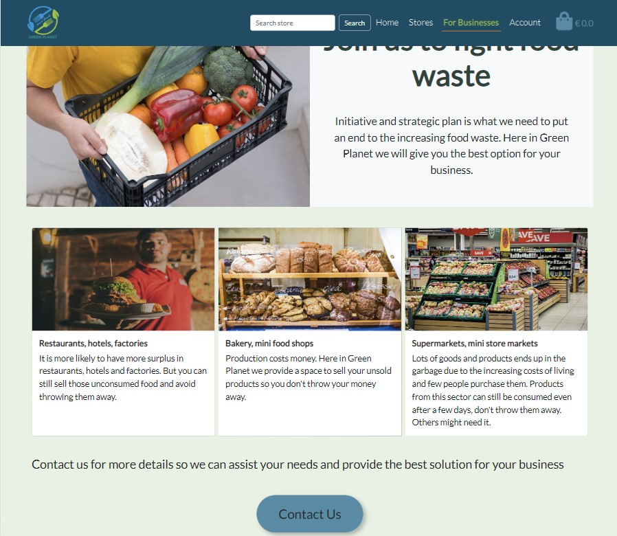

### Account

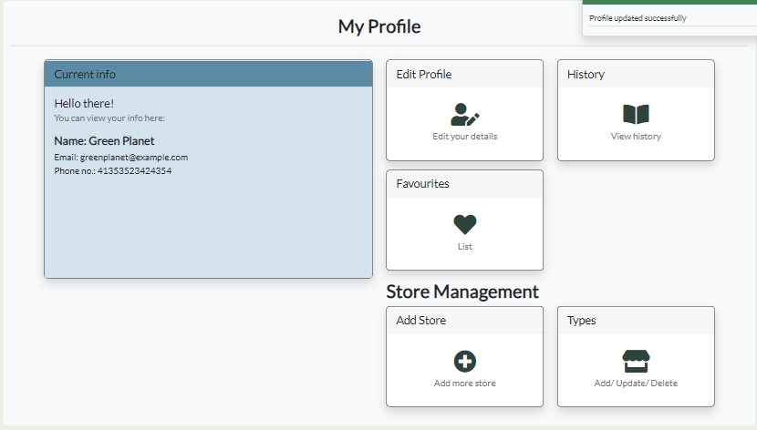

### Bag

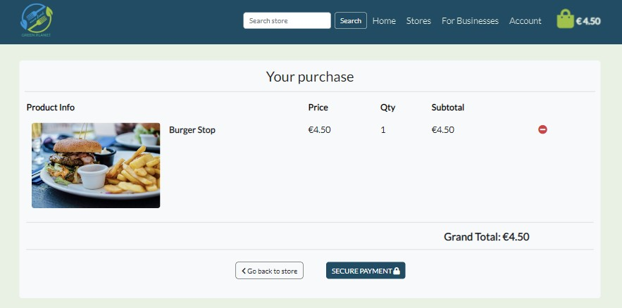

[Back to Top](#table-of-contents)

### Checkout

#### Checkout with user details

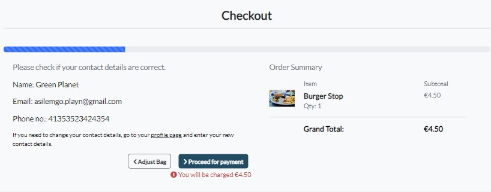

#### Checkout payment

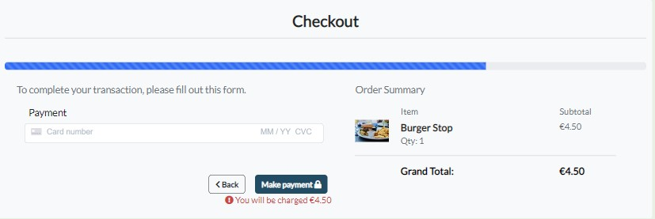

### Checkout success message

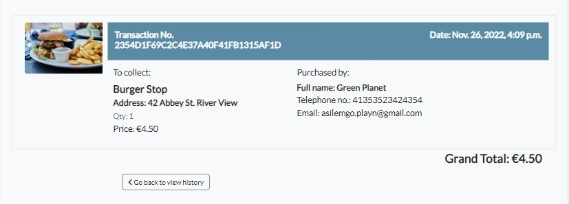

[Back to Top](#table-of-contents)

#### Notification message

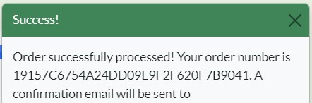

### Contact us response

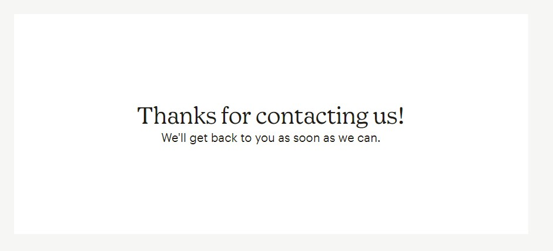

### Mailchimp subscription form

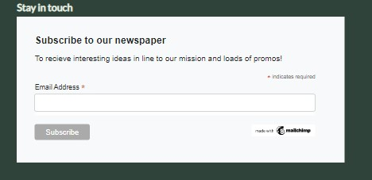

#### Subscription response

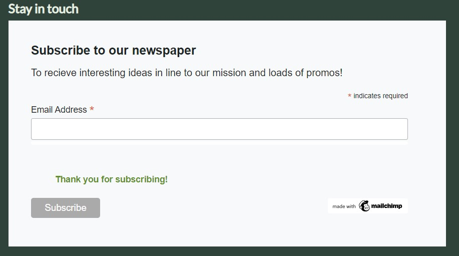

### Web Marketing

For this ecommerce project I have chosen to use free web marketing strategies. These are:

   - SEO and content marketing
   - Social media marketing
   - Email newsletter subscription

#### SEO IMPLEMENTATION

Some of the tecniques for SEO implementation for this project is done by using semantic HTML, minimize the keyword stuff but use these keywords in natural sentences in content of the website, use descriptive alt attribute for images, use metadata description and keyword on the head level of the project and using noopener in rel and descriptive aria-label attributes for external links.

The keywords are short-tailed and long-tailed for this project, and after much deliberation these keywords are as follows:
      
   - leftovers, low cost, save food, reduce waste, save planet, great discount food, unsold good, guaranteed low price, surplus food, unsold food from restaurants, great discount products from supermarkets,
   fight food waste.

For a good SEO implementation robots.txt is also added at the project root level which tells search engine crawlers which URLs the crawler can access on the website. This is used mainly to avoid overloading the site with requests; it is not a mechanism for keeping a web page out of Google.

Sitemap.xml was also included in the project root level. It is a file that lists a website’s essential pages, making sure Google can find and crawl them all. It also helps search engines understand your website structure. You want Google to crawl every important page of your website. But sometimes, pages end up without internal links pointing to them, making them hard to find. A sitemap can help speed up content discovery.

 

#### Social Media Marketing

The social media platform chosen for web marketing was Facebook, because it has the largest number of users and the widest demographic. The purpose of a Facebook bussines page is to get potential customers attention on the business and to promote company's products and services. The facebook page was created using my personal facebook page. Deactivated after taking screenshot.

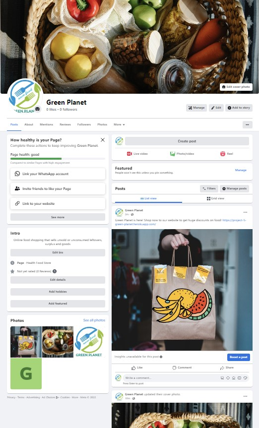

 

#### Email Marketing

The use of email within the ecommerce projects is to promote a business’s products and services, as well as customer loyalty. Email marketing is a  a key pillar of your digital marketing strategy. It is a form of marketing that can make the customers on your email list aware of new products, discounts, and other services.

Mailchimp was used for the subscription form for newsletter that can help optimize email marketing to get the best marketing program.

 
[Back to Top](#table-of-contents)
 
### Future Features:
 
* For future features not implemente and this is included in the user story: REVIEWS. Due to the limited time, I couldn't start to implement it. For this feature it would be nice to have a review section where user who have tried the food from a store can leave a review and ratings.

* I could have added more shipping details and more billing details to be able to include home delivery to any orders, but as time was very limited changing the code and trying to make it work would take a lot of time. So for future feature I leave this to be implemented.

* Add more store in the store page to offer more promos and discounted food to customers.

* Expand the FAQ content thus it is not complete, and fix the scrollspy problem and the UI of this page is not good.

* Add a blog section where admin, shoppers, or guests can browse to any interesting content regarding food saving, money saving, keeping the environment clean and reducing food waste at home or inside their businesses.

* Add the filter all in the navbar instead of using it inside the store webpage.
 
## Testing
 
Testing was carried out manually throughout the development of this project. Constant testing was done using Chrome Dev tools. Tested the website in different devices and sizes.

Testing and results can be found [here](testing.md).
 
[Back to Top](#table-of-contents)
 
## Deployment
 
The project's repo was hosted on GitHub and it was deployed on Heroku

### Heroku Setup and CLI

Deploying Python to GitHub itself won't work, since Github can only handle front-end files such as HTML, CSS, and JavaScript. So this project it needs to be deployed to a hosting platform that can render Python files. One such platform is [Heroku](https://id.heroku.com/login).

- sign up / login to [Heroku](https://id.heroku.com/login) website to create or login to your account
- if necessary, install the heroku CLI in Gitpod: `curl https://cli-assets.heroku.com/install.sh | sh`
- login to Heroku CLI: `heroku login -i`

### Create database with ElephantSQL
 1. Log in to ElephantSQL.com to access dashboard.

 2. Click “Create New Instance”.

 3. Set up plan

      - Give it a Name (this is commonly the name of the project)

      - Select the Tiny Turtle (Free) plan

      - Leave the Tags field blank

4. Select “Select Region”.

5. Select the nearest data center.

6. Click "Review".

7. Check details are correct and then click “Create instance”.

### Creating a Heroku App

A Heroku app can be created in CLI or on [Heroku website](https://id.heroku.com)

1. Click New to create a new app.

2. Give app a name and select closest region. When done, click Create app to confirm. Heroku app names must be unique.

#### Create Heroku app in CLI
- In the terminal: `heroku apps:create app-name --region eu`
- view the apps in CLI: `heroku apps`
- view the key remotes in CLI: `git remote -v`

### Connecting Database on Heroku

1. Open the Settings tab in the Heroku app

2. Add the config var DATABASE_URL, and for the value, copy in the database url from ElephantSQL.

### Installing Project Requirements

The `db.sqlite3` database cannot be used in Heroku and Heroku had ended their free tier offerings for deployment with its platform. We used ElephantSQL instead of Postgres for this project.

- install a database url package: `pip3 install dj-database-url==0.5.0 psycopg2` - this package allows us to parse the database url that Heroku created
- refreeze the requirements file: `pip3 freeze > requirements.txt`
- in `settings.py`
   - import "dj_database_url" underneath import os
   - comment out the original "DATABASE" settings and paste in ` DATABASES = {
     'default': dj_database_url.parse('your-database-url-here')
   }`. DO NOT commit this file with your database string in the code, this is temporary
   - run migrations: `python3 manage.py migrate`
   - Create a superuser for your new database `python3 manage.py createsuperuser`.
   - To prevent exposing the database when pushing to GitHub, delete it again from settings.py and uncomment the original "DATABASE".
   - Check ElephantSQL to confirm database is created

### Deployment to Heroku
1. In `settings.py` delete the database created and replace it with:

`if 'DATABASE_URL' in os.environ:
    DATABASES = {
     'default': dj_database_url.parse(os.environ.get('DATABASE_URL'))
    }
else:
    DATABASES = {
        'default': {
            'ENGINE': 'django.db.backends.sqlite3',
            'NAME': BASE_DIR / 'db.sqlite3',
        }
    }`

2. install webserver: `pip3 install gunicorn` - replaces the development server once the app is deployed to Heroku

3. run `pip3 freeze > requirements.txt` - creates a file to let heroku know which packages to install.

4. Create Procfile file

5. Add this code for Heroku to create web dyno: `web: gunicorn green_planet.wsgi:application`

6. Go to Heroku, settings , config var and add variable:
`COLLECTSTATIC` : 1 ,so that Heroku won't try to collect staticfiles when we deploy.

7. Add the hostname of the Heroku app to `ALLOWED_HOSTS` in settings.py

8. Push the code to Github

9. In the terminal run: `heroku git:remote -a heroku-app-name`

10. git push heroku main to deploy to heroku

### Connecting Heroku to Github

By connecting Heroku to Github the application will automatically deploy the latest code to Heroku.

1. In heroku app, open app, in "Deploy" tab, under the "Deployment method" setting select "GitHub"

2. Search for repository and click "Connect"

3. Choose "Enable Automatic Deploys"

### Config vars

Config vars are needed to be created in Heroku so that to conect the app to Django, AWS, stripe and email.

### Github

#### Create a new repository

- Log into [GitHub](https://github.com/)
- On the 'Repositories' tab click 'New'
- Name the repository and click 'Create repository'

#### Forking

- Sign into Github and go to my [repo](https://github.com/ChrisT-CC/H2B-PP5-ecommerce)
- Press the "Fork" button the top right corner of page
- Click "Create fork"

#### Cloning

- Sign in to Github and go to my [repo](https://github.com/ChrisT-CC/H2B-PP5-ecommerce)
- Above the list of files click "Code"
- Select HTTPS, SSH or Github CLI, then click the copy button to get the URL
- Open your IDE of choice
- Type "git clone" and then paste the URL you copied
- Press Enter

[Cloning a repository In GitHub documantation](https://docs.github.com/en/repositories/creating-and-managing-repositories/cloning-a-repository)

 
[Back to Top](#table-of-contents)
 
## Credits
 
### Photos

   - Pixabay
   - Pexels
   - Vecteezy

### Code

   - Stackoverflow
   - Boutique Ado Walkthrough
   - [Add favourites](https://www.google.com/search?q=how+to+add+an+item+as+favorites+in+django&rlz=1C1VDKB_esES996ES996&oq=how+to+add+an+item+as+favorites+in+django&aqs=chrome..69i57j33i160.11627j0j7&sourceid=chrome&ie=UTF-8#kpvalbx=_26JwY5-KJYzbgQbxlbKQBg_33)
   - [Costumize user model and extend user field](https://www.youtube.com/watch?v=NLHmadrP8Y4)
   - [Loader animation](https://webdeasy.de/en/css-loading-animations/)
   - [Buzzing animation in Login and Signup form](https://unused-css.com/blog/css-shake-animation/)

### Other

   - [Color pallete](http://paperheartdesign.com/blog/color-palette-terrific-teal)
   - [Free privacy policy generator]( https://www.privacypolicygenerator.info/)
 
[Back to Top](#table-of-contents)
 
#### Special Thanks & Acknowledgements:

* To my mentor who has been guiding and helping me through out the project. He's been so friendly and kind.

* To all the tutors who helped me fix a lot of bugs in my code. You were all a life saver.
 
* Team 11 🤜 Christmas Hackathon who inspires me everyday.

* To my family, most especially to my husband who was very supportive throughout my journey, and to my daughter who gives me strength to continue.

* To the slack community and all my fellow student in Code Institute.

###### <i>Disclaimer: This project was created for educational use only as part of Code Institute's Porject Portfolio 4</i>
 
[Back to Top](#table-of-contents)